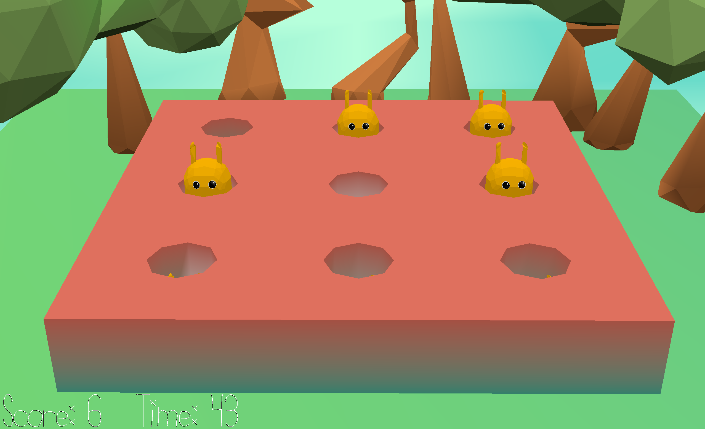

Moles?

Author: Leo Gong

Design: Whack a mole except its not really moles and its weird looking things that are pretty cute. The general artistic vision was more stylized and animated
code base did not have enough support for blender geometry and animated textures nodes that were frame dependent. 

Screen Shot:

How To Play: Wait for the mole to FULLY pop up and then hit it on the head by clicking it. The game gets harder the higher you score and the longer it goes on, so be aware. 

M1 to hit the mole. 

This game was built with [NEST](NEST.md).
